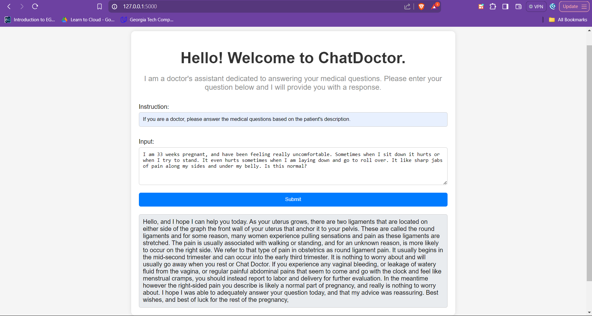

# BERT-Chatbot

## Project Overview

This project implements a machine learning model for answering medical questions. It uses the BERT architecture (Bidirectional Encoder Representations from Transformers) for sequence classification, specifically the Bio_ClinicalBERT model, to understand and respond to medical queries. The model is finetuned on the ChatDoctor-HealthCareMagic-100k dataset, which contains a large number of medical questions and their corresponding answers. This README provides a comprehensive guide to understanding, setting up, and running the project.

## Table of Contents

- [Project Overview](#project-overview)
- [Features](#features)
- [Installation](#installation)

- [Dataset](#dataset)
- [Dataset Details](#dataset-details)
- [Installation](#installation)
- [Usage](#usage)
- [Deployment](#deployment)
- [Screenshots](#screenshots)
- [License](#license)

## Features

- Utilizes Bio_ClinicalBERT for understanding medical terminology
- Handles both the instruction and the input query
- Implements text cleaning and preprocessing
- Includes semantic search functionality for improved response selection
- Has an interactive interface built using Flask, HTML, and css
- Provides a Flask API for easy integration into web applications

## Dataset

The dataset used in this project is the ChatDoctor-HealthCareMagic-100k dataset, which contains medical queries and their corresponding responses. The dataset has been preprocessed to select a subset of the data for training and evaluation purposes.

## Dataset Details
Source: Lavita - ChatDoctor-HealthCareMagic-100k
Size: 100,000 medical queries and responses
Subset: The first 15,000 rows are selected for this project

## Installation

1. Clone the repository:
   ```
   git clone https://github.com/your-username/medical-qa-model.git
   cd medical-qa-model
   ```
   
2. Create a virtual environment:
   ```
   python -m venv venv
   source venv/bin/activate  # On Windows use venv\Scripts\activate
   ```
   
3. Install the required packages:
   ```
   pip install -r requirements.txt
   ```

## Usage

Run the final.ipynb notebook to train the model.

### Steps followed in the final.ipynb notebook

1. Dataset Preprocessing:

- Clean the text by removing special characters and converting it to lowercase.
- Tokenize the text using BERT's tokenizer.
- Prepare input tensors for the BERT model.

2. Data Splitting:

Split the dataset into training, validation, and test sets.

3. Model Training
The model used in this project is BertForSequenceClassification from the Hugging Face Transformers library, fine-tuned on the prepared dataset.

The model is fine-tuned using the Trainer class, with custom training arguments including learning rate, batch size, and number of epochs. 

After training, the model, tokenizer, and label mapping are saved for later use in the Flask application.

4. Evaluation

The model's performance is evaluated using various metrics calculated on the validation and test datasets.


## Deployment
The chatbot is deployed using a Flask web application that serves a REST API. The model and tokenizer are loaded into the Flask app, and predictions are made based on user inputs.

- Starting the Flask application:
```
python app.py
```

- API Usage:
You can send a POST request to the /predict endpoint with a JSON body containing the instruction and input text.

Example request:

```
curl -X POST http://localhost:5000/predict -H "Content-Type: application/json" -d '{
  "instruction": "If you are a doctor, please answer the medical questions based on the patient's description.",
  "input": "I have a headache and fever. What should I do?"
}'
```

## Acknowledgments

The creators of the ChatDoctor-HealthCareMagic-100k dataset
The Hugging Face team for their transformers library
The creators of Bio_ClinicalBERT

## License
This project is licensed under the MIT License.

## Screenshots




